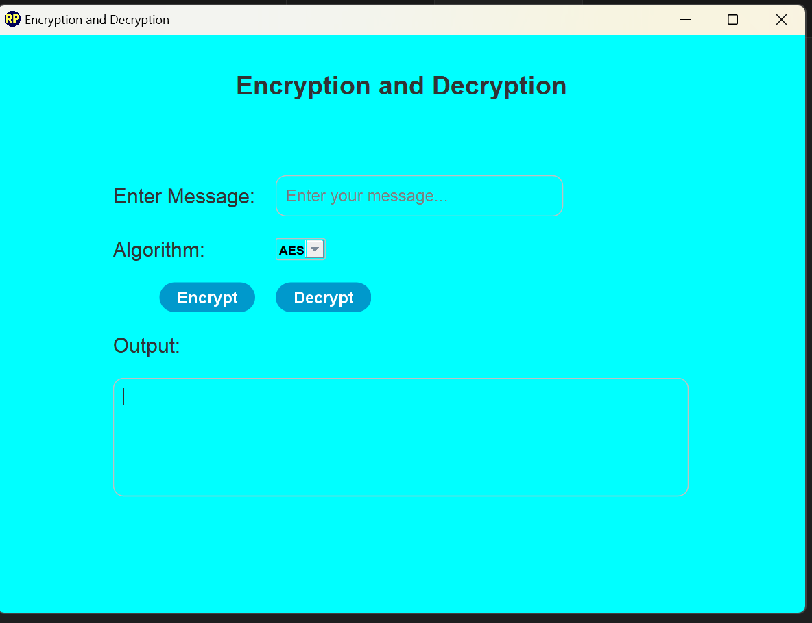
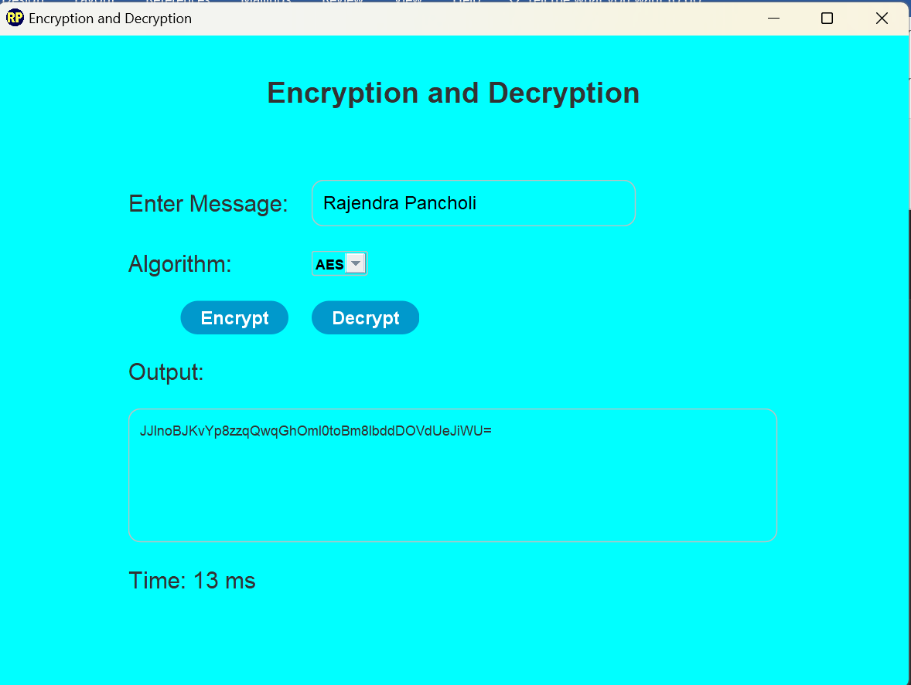
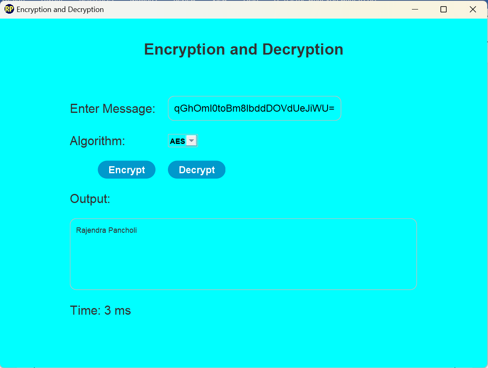

# Client-Server Encryption and Decryption System

This project implements a secure client-server communication system in Java, utilizing **encryption** and **decryption** techniques to ensure data confidentiality. It features a graphical user interface (GUI) developed using **Swing** and **AWT**.

## Table of Contents

- [Overview](#overview)
- [Features](#features)
- [Technologies Used](#technologies-used)
- [Setup and Installation](#setup-and-installation)
- [How to Run](#how-to-run)
- [Usage](#usage)
- [Screenshots](#screenshots)
- [Future Enhancements](#future-enhancements)
- [Contributing](#contributing)

---

## Overview

The project demonstrates secure data transfer between a **client** and a **server** using encryption algorithms. It includes a Java Swing GUI for user interaction, making it a complete solution for learning and applying cryptography in Java.

## Features

- **Client-Server Architecture**:
  - Communication over sockets for sending and receiving messages.
- **Encryption and Decryption**:
  - Ensures data security using standard cryptographic algorithms (e.g., AES, RSA, or others).
- **Graphical User Interface (GUI)**:
  - Built with Java Swing and AWT for better usability.
- **Secure Key Exchange**:
  - Keys are exchanged between client and server securely to prevent interception.

## Technologies Used

- **Java SE**: Programming language and core libraries.
- **Swing**: For creating a graphical user interface.
- **AWT**: For additional GUI components.
- **Socket Programming**: For client-server communication.
- **Cryptographic Algorithms**: For data encryption and decryption.

## Setup and Installation

### Prerequisites

1. Java JDK 8 or higher installed.
2. Basic understanding of Java Swing and socket programming.
3. An IDE such as IntelliJ IDEA, Eclipse, or VS Code.

### Steps

1. Clone the repository:
   ```bash
   git clone https://github.com/rajendrapancholi/client_server_encrypt_decrypt.git
   ```
2. Navigate to the project directory:
   ```bash
   cd client_server_encrypt_decrypt
   ```
3. Open the project in your preferred IDE.

## How to Run

### Compile the Java files:

Open a terminal and navigate to the src folder where the .java files are located.
Compile both files:

```bash
javac EncryptionServer.java EncryptionClientGUI.java
```

### Start the Server:

Run the EncryptionServer class to start the server:

```bash
java EncryptionServer
```

This will open the server-side interface and prepare it to handle client requests.

### Start the Client:

Run the EncryptionClientGUI class to launch the client-side GUI:

```bash
java EncryptionClientGUI
```

This will open the client application where users can enter messages to encrypt and send to the server.

### Communicate:

Use the client GUI to send encrypted messages to the server.
The server will receive, decrypt, and display the original message.

### Usage

- Launch the server application (EncryptionServer.java).
- Open the client GUI application (EncryptionClientGUI.java).

#### Use the GUI to:

- Enter messages to encrypt.
- Send encrypted messages to the server.
- View decrypted messages on the server.

### Screenshots

#### 1. Application Home Interface



#### 2. Encrypt texts



#### 3. Decrypt texts



### Future Enhancements

- Add support for multiple clients.
- Implement advanced cryptographic algorithms.
- Incorporate secure authentication mechanisms.
- Optimize GUI design for better usability.

## 🛠️ Contribution Guidelines

We welcome contributions! If you'd like to improve existing solutions, add new ones, or fix bugs, please consider the following steps:

1. Fork the repository.
2. Create a new branch (`git checkout -b feature/your-feature`).
3. Make your changes and commit them (`git commit -m 'Add feature'`).
4. Push to the branch (`git push origin feature/your-feature`).
5. Open a pull request.

---

## 🤝 Contact

For any queries or feedback, feel free to reach out:

- **Rajendra Pancholi**: [rpancholi522@gmail.com](mailto:rpancholi522@gmail.com)
- **Website**: [www.rajendrapancholi.com](https://rajendrapancholi.vercel.app/)
- **LinkedIn**: [www.linkedin.com/in/rajendra-pancholi](https://www.linkedin.com/in/rajendra-pancholi-11a3a5286/)

---

Happy Coding Journey! 👨‍💻👩‍💻
